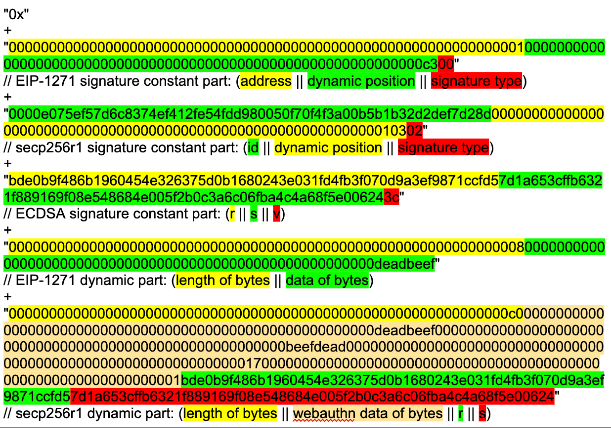

# TL;DR

This document draws inspiration from the [Safe Signatures Encoding](https://docs.safe.global/advanced/smart-account-signatures#encoding) and expands the schemes to include support for the secp256r1 curve and multisig.


# Signature Types By Methods

The following signature types represent different signing methods.


## SigType == 0

Contract signature (EIP-1271).


### Constant part

{32-bytes signature verifier} -  padded address of the contract that implements the EIP-1271 interface to verify the signature

{32-bytes data position} - position of the start of the signature data (offset relative to the beginning of the signature data)

{1-byte signature type} - 0


### Dynamic part

{32-bytes signature length} - the length of the signature

{bytes signature data} - signature bytes that are verified by the signature verifier


## SigType == 1

Pre-validated signature that we do not support now.


## SigType == 2

Secp256r1 signature.


### Constant part

{32-bytes public key onchain id} - onchain identifier calculated from `bytes30(uint240(uint256(keccak256(abi.encode(x, y)))))` then left padded with two zero bytes. Note: this will be updated to `keccak256(abi.encode(x, y))` eventually. 

{32-bytes webauth, signature and public key position} - position of the start of the bytes data (offset relative to the beginning of the signature data)

{1-byte signature type} - 2


### Dynamic part

{32-bytes bytes length} - the length of the webauth, signature and public key bytes data

{bytes webauth, signature and public key data} - {bytes authenticatorData, string clientDataJSON, uint256 challengeIndex, uint256 typeIndex, uint256 r, uint256 s}


## SigType > 26 && SigType &lt; 31

Secp256k1 signature.


### Constant part

{32-bytes r} - signature component represents the x-coordinate of a point on the elliptic curve

{32-bytes s} - signature component ensures that the signature is both tied to the specific message and verifiable by the signer's corresponding public key

{1-byte v} - we use the signature type byte to encode v; given that the elliptic curve used in ECDSA has two potential y-coordinates for a given x-coordinate, the v value helps identify which of the two corresponding points is the correct public key


## SigType > 30

eth_sign signature that we do not support.


# Signature Types By Digests

We're extending SigType to differentiate the digest types.


## SigType >= 32

Used in aggregated multi sigs to indicate diverse interpretations, including a signature authenticating an actual digest. We do v -= 32 in the contract to normalize v iff v >= 32 (v is the SigType byte).


# Examples

Assuming that three signatures are required to confirm a transaction where one signer uses an EOA to generate a ECDSA signature, another a contract signature and the last a pre-validated signature:

We assume that the following addresses generate the following signatures:


```
0x1 (EIP-1271 constant part) -> 0000000000000000000000000000000000000000000000000000000000000001 (address) + 00000000000000000000000000000000000000000000000000000000000000c3 (dynamic position) + 00 (signature type)
The contract takes the following bytes (dynamic part) for verification 00000000000000000000000000000000000000000000000000000000deadbeef
```


```
0x2 (secp256r1 constant part) ->  0000e075ef57d6c8374ef412fe54fdd980050f70f4f3a00b5b1b32d2def7d28d (id) + 0000000000000000000000000000000000000000000000000000000000000103 (dynamic position) + 02 (signature type)

It has the following bytes (dynamic part) for verification 00000000000000000000000000000000000000000000000000000000deadbeef (authenticatorData)
00000000000000000000000000000000000000000000000000000000beefdead (clientDataJSON)
0000000000000000000000000000000000000000000000000000000000000017 (challengeIndex)
0000000000000000000000000000000000000000000000000000000000000001 (typeIndex)
bde0b9f486b1960454e326375d0b1680243e031fd4fb3f070d9a3ef9871ccfd5 (r)
7d1a653cffb6321f889169f08e548684e005f2b0c3a6c06fba4c4a68f5e00624 (s)
```


```
0x3 (EOA address) -> bde0b9f486b1960454e326375d0b1680243e031fd4fb3f070d9a3ef9871ccfd5 (r) + 7d1a653cffb6321f889169f08e548684e005f2b0c3a6c06fba4c4a68f5e00624 (s) + 
3c (v is increased from 28 to 60)
```


Note: signature type += 32 if it's signing over the actual digest in a multisig context.

The constant parts need to be sorted so that the recovered signers are sorted ascending (natural order) by address (not checksummed).

The signatures bytes used for transaction would therefore be the following:<br/><br/>

